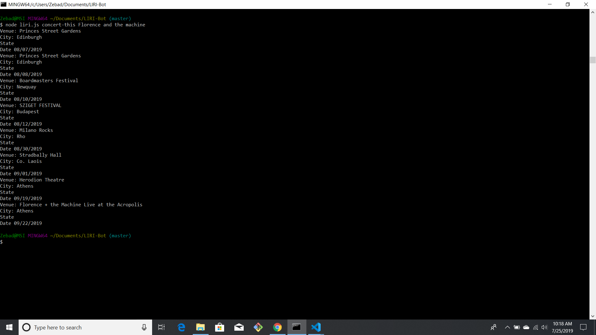
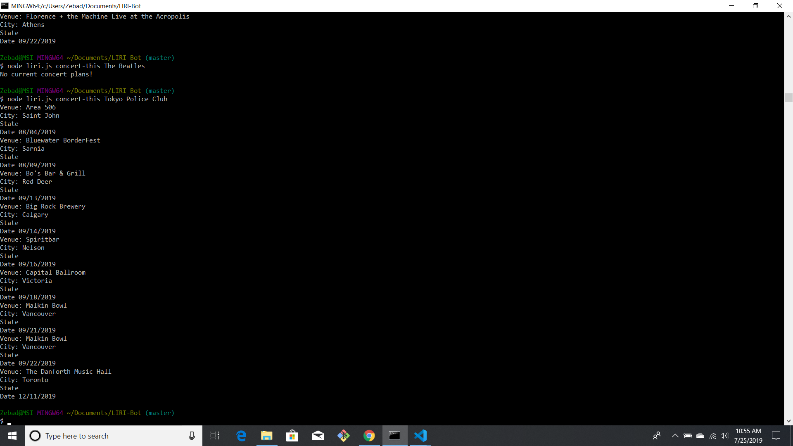
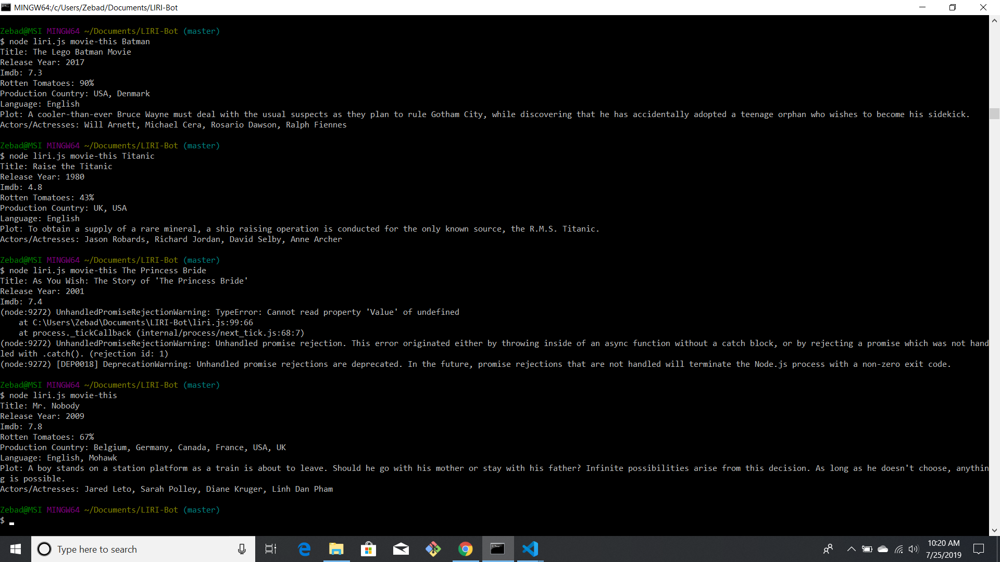
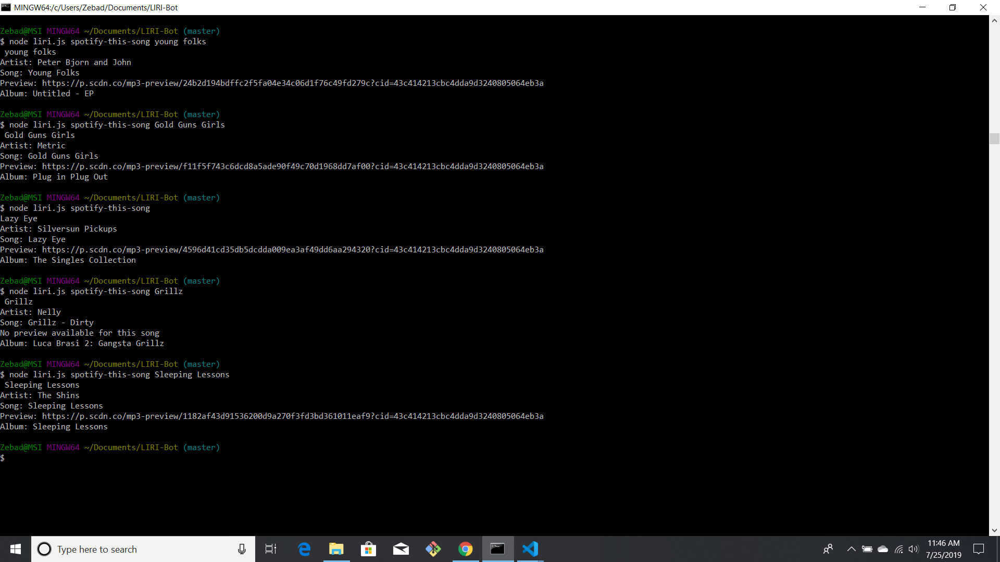

# LIRI-Bot

Welcome to LIRI-Bot!
With this program you are able to find info to movies, songs, and concert location of any band!
## LIRI-Concerts
-------
With LIRI-Concerts you are able to enter any band name and see locations and dates of upcoming concerts.
In order to access the information enter the command  line *node liri.js concert-this <artist/band name here>*.

This will then search the Bands in Town Artist Events API and return.

+ Name of the venue
+ Venue location
+ Date of the Event (use moment to format this as "MM/DD/YYYY")

If there are no concerts in the foreseable future it returns  No concerts in the foreseeable future!

------
## LIRI-Movies
-------
With LIRI-Movies you are able to enter any movie title and see information about that movie.
In order to access the information enter the command  line *node liri.js movie-this '<movie name here>'*.

This will then search the OMDB API and return.

* Title of the movie.
* Year the movie came out.
* IMDB Rating of the movie.
* Rotten Tomatoes Rating of the movie.
* Country where the movie was produced.
* Language of the movie.
* Plot of the movie.
* Actors in the movie.

If there is no movie is typed into the search area it returns results for Mr.Nobody

------
## LIRI-Spotify
-------
With LIRI-Spotify you are able to enter any song and see artist and album information about that song.
In order to access the information enter the command  line *node liri.js spotify-this-song '<song name here>'*.

This will then search the Spotify API and return.

+ Artist(s)
+ The song's name
+ A preview link of the song from Spotify
+ The album that the song is from

If no preview is availabe it returns No preview available for this song

If no song is typed into the search area it returns results for Lazy Eye by the Silversun Pickups

